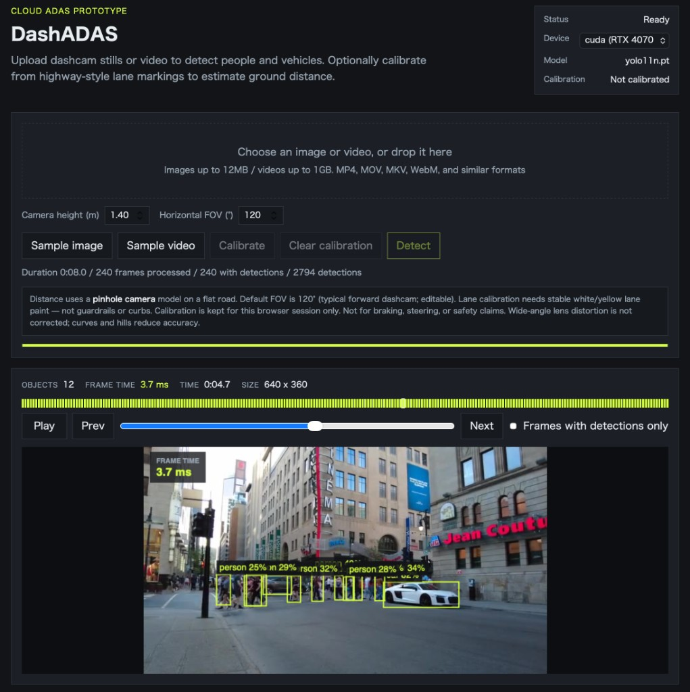
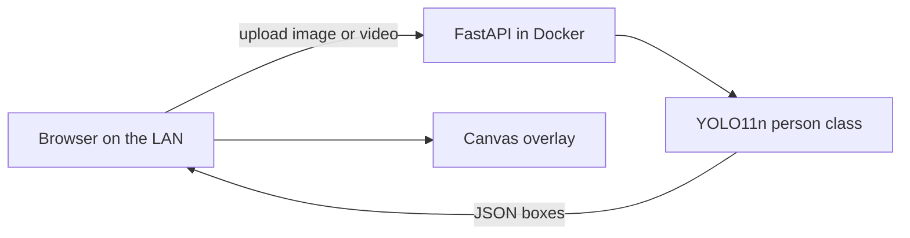

# DashADAS

A **Linux** pedestrian-detection service with a **Web UI**. Docker on the Linux host runs YOLO on CPU, an NVIDIA GPU, or Qualcomm QNN CPU emulation; you open the UI in a browser on the LAN (`http://HOST:8080`) and upload a dashcam still or video. The page draws bounding boxes.

This is a **lab / LinkedIn demo**, not a production vehicle ADAS. There is no control loop, no real-time guarantee, and no authentication.

Repository: [KojiTanaka2025/DashADAS](https://github.com/KojiTanaka2025/DashADAS)



*Screenshot: the **Web UI** in a browser at `http://HOST:8080`. Detection runs in Docker on the Linux GPU host.*

## What it does

- Detects **people only** with a pretrained YOLO11n model
- Overlays boxes in the browser (the server returns JSON, not burned-in images)
- Samples video at a chosen interval, including **30 fps** on a GPU host
- Plays the result in the Web UI (Play / Pause, timeline)
- **Sample image** uses the public Ultralytics `bus.jpg`
- **Sample video** fetches a public street clip with pedestrians, trims it to 8 seconds, then detects and plays it

Open the UI, click **Sample video**, wait for the progress bar, then watch the 30 fps overlay.

## Requirements

Use the combinations below. The remote installer **refuses other guest OS / CPU architectures** instead of half-installing.

### Tested in this lab

| Role | Guest | Host hypervisor | Notes |
| --- | --- | --- | --- |
| CPU LAN demo | **Ubuntu 24.04 Server** amd64 QEMU VM | Proxmox VE **9.1** | Docker CE, no GPU |
| 30 fps GPU demo | **Debian 13** amd64 **privileged LXC** | Proxmox VE **9.1**, NVIDIA driver **550+** | Shared host GPU; `nvidia-smi` works in the CT |
| Laptop UI | Chrome or Safari on the same LAN | — | Open `http://HOST:8080` |

Also works for a quick try: Docker Desktop on macOS (CPU inference only, including Apple Silicon).

### Guest OS (SSH install target)

Supported **only**:

- Ubuntu **22.04** or **24.04** (Server ISO, amd64)
- Debian **12** or **13** (standard amd64 CT/VM template)

Use **Server / minimal**, not Ubuntu Desktop, and **do not install Docker from Snap**. The script installs **Docker CE + Compose v2** from `download.docker.com`.

Not supported by `scripts/bootstrap.sh`: ARM/Raspberry Pi, Apple Silicon as the *guest*, Fedora/RHEL, Windows, unprivileged GPU LXC.

### Guest size

| Mode | vCPU | RAM | Disk (guest `/`) |
| --- | --- | --- | --- |
| CPU | 2+, **4 recommended** | 4 GiB+, **8 GiB recommended** | **20 GiB+** total, **15 GiB free** for the image build |
| GPU | **4+** | **8 GiB+** | **32 GiB+** total, **25 GiB free** for the CUDA image build |

The CUDA image is large (PyTorch cu124). A 8–16 GiB CT disk will fail during `docker compose build`.

### GPU / Proxmox

- NVIDIA driver **550+** on the **Proxmox host**.
- In the guest, `nvidia-smi` must already work **before** `./scripts/install-remote.sh --gpu`. The installer does not install the NVIDIA kernel driver.
- **Share** `/dev/nvidia0` (and `nvidiactl` / `nvidia-uvm` / `nvidia-modeset`) into a **privileged** LXC with **Nesting=on**, the same way as other GPU containers on the host.
- Inside the LXC, install matching NVIDIA userspace with the `.run` installer and **`--no-kernel-module`**.
- **Do not** PCI-passthrough a consumer GPU into a VM if other LXCs already use that GPU on the host.
- Docker in LXC needs **Nesting**. GPU CTs need **privileged** (unprivileged NVIDIA device nodes will not show up).

### Network, SSH, browser

- Guest has a **LAN IPv4** address. TCP **8080** must be free.
- Outbound **HTTPS** from the guest to at least: `download.docker.com`, `nvidia.github.io` (GPU), `download.pytorch.org`, `github.com`, and the sample-video hosts (Pexels / GitHub). No HTTP proxy is configured by the scripts.
- Operator laptop: OpenSSH client; `ssh YOUR_HOST` works **without a password prompt** (`BatchMode`). For `--sync`, **rsync** is required locally.
- Guest account: **root** or **passwordless sudo** (the bootstrap runs non-interactively).
- If root SSH fails with `Too many authentication failures`, set `IdentitiesOnly yes` and a single `IdentityFile` in `~/.ssh/config`.
- If this GitHub repo is **private**, use `--sync` instead of `git clone` on the guest.
- Browser: current **Chrome** or **Safari** on the same LAN. Do not NAT/port-forward 8080 to the internet.

The API has **no login**. Default Compose binds `127.0.0.1:8080`. The remote installer publishes `8080` on the LAN for a home-lab demo. Do not port-forward it to the internet.

## Install on a remote VM or LXC

From a machine that can already SSH to the guest:

```bash
git clone https://github.com/KojiTanaka2025/DashADAS.git
cd DashADAS
chmod +x scripts/install-remote.sh scripts/bootstrap.sh
./scripts/install-remote.sh YOUR_HOST
```

`YOUR_HOST` is any SSH name, for example `gpu-host` or `user@192.168.1.10`.

The script will:

1. Confirm passwordless SSH
2. Refuse the guest unless it is Ubuntu 22.04/24.04 or Debian 12/13 amd64, with root or passwordless sudo
3. Install Docker CE from docker.com (and NVIDIA Container Toolkit when `nvidia-smi` works)
4. Clone this repository on the guest (or `--sync` this checkout)
5. Build, start, and wait for `/api/health`
6. Print the LAN URL, for example `http://192.168.1.10:8080`

If the GitHub repository is still private, pass `--sync` so the installer copies this checkout instead of `git clone`.

```bash
./scripts/install-remote.sh --gpu YOUR_HOST     # require CUDA
./scripts/install-remote.sh --cpu YOUR_HOST     # CPU image even if a GPU exists
./scripts/install-remote.sh --sync YOUR_HOST    # copy local files instead of git clone
```

On the guest itself (already logged in):

```bash
curl -fsSL https://raw.githubusercontent.com/KojiTanaka2025/DashADAS/main/scripts/bootstrap.sh | bash
```

Or copy `scripts/bootstrap.sh` and run it as root.

## Run environments

Pick **one** environment. Each has its own compose command. The Web UI Device menu only lists backends that environment actually provides.

### Docker (CPU)

Use this for a laptop or a CPU-only Linux guest. Inference is PyTorch on CPU.

```bash
git clone https://github.com/KojiTanaka2025/DashADAS.git
cd DashADAS
docker compose up --build
```

Then open [http://localhost:8080](http://localhost:8080). On Apple Silicon this is CPU inference only.

On a remote Linux VM or LXC, publish port 8080 on the LAN:

```bash
docker compose -f compose.yaml -f compose.lan.yaml up --build -d
```

The Device menu shows `cpu`.

### CUDA

Use this on a Linux amd64 guest where `nvidia-smi` already works. Inference is PyTorch on the NVIDIA GPU.

```bash
docker compose -f compose.yaml -f compose.gpu.yaml up --build -d
```

The Device menu shows `cpu` and `cuda`. Use **30 fps** video here, on short clips.

Do not mix this command with the QNN overlay unless you also followed the QNN steps below.

### QNN

Qualcomm QNN **CPU emulation** of the same pedestrian model. This checks that the QNN graph runs; it is not Hexagon DSP timing and it is not a GPU path.

**Host:** Linux amd64 only (Ubuntu 22.04 / 24.04 or Debian 12 / 13). macOS cannot convert or run QNN (`libQnnCpu.so` is ELF).

1. Start **Docker (CPU)** or **CUDA** on that Linux host once, so `dashadas:cpu` or `dashadas:gpu` exists.
2. Copy the QAIRT/QNN SDK into `QNN/<version>/` (see `QNN/README.md`). Do not commit it.
3. Convert YOLO11n (uses that Docker image, Python 3.12):

```bash
chmod +x scripts/qnn-env.sh scripts/convert-qnn-yolo.sh
./scripts/convert-qnn-yolo.sh
```

4. Start the QNN environment and choose **qnn (CPU emu)** in the Device menu:

```bash
docker compose -f compose.yaml -f compose.lan.yaml -f compose.qnn.yaml up --build -d
```

The Device menu shows `cpu` and `qnn`. QNN does not need a GPU.

To keep CUDA on a GPU guest as well, replace `compose.lan.yaml` with `compose.gpu.yaml` after the convert step. That is optional.

#### Snapdragon Ride (scope)

Japanese OEM ADAS DCUs often use **Snapdragon Ride**. On those SoCs, the heavy perception CNN typically runs on the **Hexagon HTP** through **QAIRT / QNN** (quantized context binary, `libQnnHtp.so`), sometimes still via SNPE on older programs.

This repo is a **lab look at that family**, not a Ride port. It converts the same class of ONNX graph with the QAIRT tools and runs it on the **x86 QNN CPU backend** (`libQnnCpu.so`) so the graph and post-process can be checked without an SA-series board. It does **not** claim HTP performance, ISO 26262, QNX, or in-vehicle integration.

## Architecture



| Piece | Choice |
| --- | --- |
| Model | YOLO11n, COCO `person` only |
| Serving | FastAPI + Uvicorn, one worker |
| Video | ffmpeg frame sampling, background jobs |
| UI | Static HTML/JS, canvas boxes |
| Runtime | Docker; CPU PyTorch, CUDA wheels, or QNN CPU emulation |

## Video settings

For a real dashcam clip, start with **1 second interval, 300 frames max**. Use **30 fps** only on GPU and on short clips. CPU can keep up with sparse sampling, not with full 30 fps dashcam.

Uploads are capped at 12 MB for images and 1 GB for video.

## Security

- No user accounts. Treat the service as a trusted-LAN demo.
- Do not commit dashcam footage, `.env` files, keys, or `.pt` weights.
- Sample media is public stock / Ultralytics demo content, not customer data.

## Disclaimer

DashADAS is a cloud-style **perception demo**. It does not steer, brake, or certify a vehicle. Timing numbers are for lab comparison of CPU, GPU, and QNN CPU emulation, not for safety claims. The QNN path shows familiarity with the QAIRT conversion/runtime used around Snapdragon Ride; it is not a Snapdragon Ride DCU implementation.
